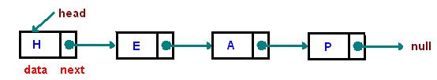
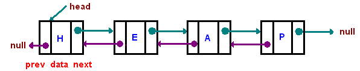

# Linked Lists

## Quick Overview
* A linked list is a linear data structure where each element is a separate object.

* Each element (we will call it a node) of a list is comprising of two items - the data and a reference to the next node. 
* The last node has a reference to null. 

* The entry point into a linked list is called the head of the list. It should be noted that head is not a separate node, but the reference to the first node. If the list is empty then the head is a null reference.

* A linked list is a dynamic data structure. The number of nodes in a list is not fixed and can grow and shrink on demand. Any application which has to deal with an unknown number of objects will need to use a linked list.

## Types of Linked Lists
### **Singly Linked List**
A linked list in which each node has a single reference: one to the next node.

### **Doubly Linked List**
A linked list in which each node has two references: one to the next node and another to previous node.

### **Circular Linked List**
Similar to doubly linked list, except that the last node of the list points back to the first node (or the head) of the list.

